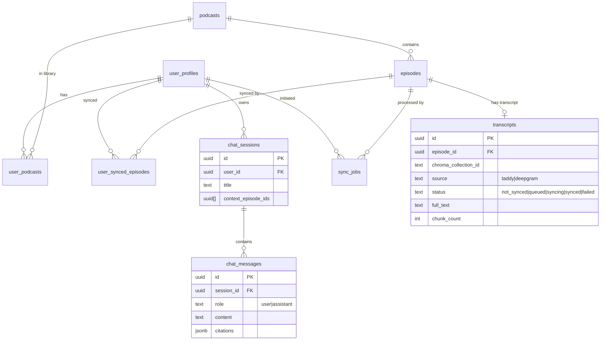

# Borrowed Brain (Podcast Chat) - Implementation Plan

> **Status**: Ready for Implementation  
> **Created**: 2025-12-27  
> **Revised**: 2025-12-27 (Phase 1 simplified post-review)  
> **Complexity**: A LOT (Comprehensive - Major Feature Implementation)

## Overview

This plan covers the remaining implementation of Podcast Chat (aka "Borrowed Brain"), a Next.js 16 application that enables AI-powered conversations with podcast content. Users can search podcasts, sync transcripts, and chat with episode content using RAG (Retrieval Augmented Generation).

### Current State Summary

| Component | Status | Notes |
|-----------|--------|-------|
| Authentication | ✅ Done | Clerk + Supabase JWT integration |
| Podcast Search | ✅ Done | Taddy API via server action |
| Library Management | ✅ Done | Add/remove podcasts |
| Database Schema | ✅ Done | 9 tables with RLS |
| UI Framework | ✅ Done | ShadCN + AI Elements |
| Taddy Client | ✅ Done | `getEpisodes()` already exists |
| Episode Browsing | ❌ Not Started | F4 |
| Transcript Sync | ❌ Not Started | F5 |
| AI Chat | ❌ Not Started | F6 |

---

## Problem Statement

Users can add podcasts to their library but cannot:
- Browse episodes within a podcast
- Sync episode transcripts for AI analysis
- Chat with podcast content using natural language

This plan addresses features F4 (Episode Browsing), F5 (Transcript Sync), and F6 (AI Chat) from the PRD.

---

## Technical Approach

### Architecture

```
┌─────────────────────────────────────────────────────────────────┐
│                     Next.js 16 App Router                       │
│  ┌──────────────┐  ┌──────────────┐  ┌──────────────────────┐  │
│  │ Episode      │  │ Sync Status  │  │ Chat Interface       │  │
│  │ Browser      │  │ Dashboard    │  │ (AI SDK + RAG)       │  │
│  │ (Server)     │  │ (Phase 2)    │  │ (Phase 3)            │  │
│  └──────────────┘  └──────────────┘  └──────────────────────┘  │
└─────────────────────────────────────────────────────────────────┘
         │                  │                     │
         ▼                  ▼                     ▼
┌─────────────────────────────────────────────────────────────────┐
│                        API Layer                                 │
│  • Direct data fetching • /api/sync          • /api/chat        │
│  • Server Components    • Trigger.dev        • RAG Retrieval    │
└─────────────────────────────────────────────────────────────────┘
         │                  │                     │
         ▼                  ▼                     ▼
┌─────────────┐    ┌─────────────┐    ┌─────────────────────────┐
│   Supabase  │    │ Trigger.dev │    │      ChromaDB           │
│  PostgreSQL │    │ Background  │    │   Vector Store          │
│             │    │    Jobs     │    │                         │
└─────────────┘    └──────┬──────┘    └─────────────────────────┘
                          │
              ┌───────────┴───────────┐
              ▼                       ▼
        ┌──────────┐           ┌──────────┐
        │  Taddy   │           │ Deepgram │
        │  (free)  │           │(fallback)│
        └──────────┘           └──────────┘
```

### Key Technical Decisions

| Decision | Choice | Rationale |
|----------|--------|-----------|
| Episode Browsing | Server Components | No client state needed, faster load |
| Episode Pagination | URL params | Bookmarkable, back button works |
| Transcript Chunking | 800 chars, 100 overlap | Balance retrieval quality and cost |
| Embedding Model | text-embedding-3-small | Cost-effective ($0.02/M tokens) |
| ChromaDB Structure | Single global collection | Simpler queries, metadata filtering |
| Real-time Updates | Trigger.dev React hooks | Built-in, type-safe |
| RAG Top-K | 5 chunks | Fits context window, good relevance |

---

## Implementation Phases

### Phase 1: Episode Browsing (F4) - SIMPLIFIED
**Estimated Files**: 2 | **Dependencies**: None  
**Approach**: Server components with URL-based pagination

### Phase 2: Transcript Sync Infrastructure (F5)
**Estimated Files**: 12 | **Dependencies**: Phase 1

### Phase 3: AI Chat with RAG (F6)
**Estimated Files**: 10 | **Dependencies**: Phase 2

### Phase 4: Polish & Edge Cases
**Estimated Files**: 5 | **Dependencies**: Phase 3

---

## Phase 1: Episode Browsing (Simplified)

> **Note**: This phase was simplified after code review. See `plans/phase-1-episode-browsing.md` for details.

### Design Principles Applied

1. **Server-First**: Use server components, no client state
2. **URL State**: Pagination via query params, not useState
3. **YAGNI**: No sorting dropdown, no sync UI (Phase 2), no infinite scroll
4. **Inline Components**: Header and episode list inline in page (only used once)

### Tasks

#### 1.1 Create Podcast Detail Page

**File**: `src/app/(app)/podcasts/[id]/page.tsx`

A single server component that:
- Fetches podcast from Supabase by ID
- Fetches episodes from Taddy using existing `getEpisodes()`
- Renders podcast header inline (artwork, name, author, episode count)
- Renders episode list inline (title, date, duration)
- Uses URL-based pagination with Previous/Next links

```typescript
// Server component - no "use client"
// Uses Next.js 16 async params: params: Promise<{ id: string }>
// Pagination via searchParams: Promise<{ page?: string }>
// Zero client-side state
```

**Acceptance Criteria**:
- [ ] Route `/podcasts/[id]` loads podcast from database
- [ ] Fetches episodes from Taddy with pagination
- [ ] Displays podcast artwork, name, author, description
- [ ] Shows episode list with title, date, duration
- [ ] Previous/Next pagination via URL params
- [ ] Shows 404 if podcast not found

#### 1.2 Update Podcast Card Navigation

**File**: `src/components/podcasts/podcast-card.tsx` (existing)

Add Link wrapper so library cards navigate to `/podcasts/[id]`.

**Acceptance Criteria**:
- [ ] Cards in library view navigate to `/podcasts/[id]`
- [ ] Search result cards retain current add behavior
- [ ] Visual hover state indicates clickability

### Phase 1 Files Summary (Revised)

| File | Action | Purpose |
|------|--------|---------|
| `src/app/(app)/podcasts/[id]/page.tsx` | Create | Podcast detail page |
| `src/components/podcasts/podcast-card.tsx` | Modify | Add navigation link |

**Removed from Phase 1** (YAGNI / defer to Phase 2):
- ~~episode-list.tsx~~ (inline)
- ~~episode-card.tsx~~ (inline)
- ~~episode-sort.tsx~~ (not needed)
- ~~loading.tsx~~ (Next.js default)
- ~~actions/episodes.ts~~ (direct fetch in server component)
- ~~podcast-header.tsx~~ (inline)
- ~~Sync status badges~~ (Phase 2)
- ~~Sync/Chat buttons~~ (Phase 2/3)

---

## Phase 2: Transcript Sync Infrastructure

### Tasks

#### 2.1 Create ChromaDB Client

**File**: `src/lib/chroma/client.ts`

```typescript
import { ChromaClient, OpenAIEmbeddingFunction } from 'chromadb'

const client = new ChromaClient({
  path: process.env.CHROMA_URL,
  auth: {
    provider: 'token',
    credentials: process.env.CHROMA_API_KEY,
  },
})

const embeddingFunction = new OpenAIEmbeddingFunction({
  openai_api_key: process.env.OPENAI_API_KEY,
  model_name: 'text-embedding-3-small',
})

export async function getCollection() {
  return client.getOrCreateCollection({
    name: 'podcast-transcripts',
    embeddingFunction,
    metadata: { 'hnsw:space': 'cosine' },
  })
}
```

**Acceptance Criteria**:
- [ ] Connects to Chroma Cloud
- [ ] Uses OpenAI embeddings
- [ ] Single collection for all transcripts

#### 2.2 Create Transcript Chunking Utility

**File**: `src/lib/chroma/chunking.ts`

```typescript
interface TranscriptChunk {
  id: string
  text: string
  episodeUuid: string
  podcastUuid: string
  startTime: number
  endTime: number
  speaker?: string
}

export function chunkTranscript(
  transcript: string,
  episodeUuid: string,
  podcastUuid: string,
  segments?: TranscriptSegment[]
): TranscriptChunk[]
```

**Chunking Strategy**:
- Max chunk size: 800 characters
- Overlap: 100 characters
- Preserve sentence boundaries
- Include speaker labels when available

**Acceptance Criteria**:
- [ ] Chunks transcript into ~800 char segments
- [ ] Maintains 100 char overlap between chunks
- [ ] Preserves timestamps from Taddy/Deepgram segments
- [ ] Generates unique chunk IDs

#### 2.3 Create Deepgram Client

**File**: `src/lib/deepgram/client.ts`

```typescript
import { createClient } from '@deepgram/sdk'

const deepgram = createClient(process.env.DEEPGRAM_API_KEY)

export async function transcribeAudio(audioUrl: string) {
  const { result, error } = await deepgram.listen.prerecorded.transcribeUrl(
    { url: audioUrl },
    {
      model: 'nova-3',
      smart_format: true,
      diarize: true,
      punctuate: true,
      paragraphs: true,
      utterances: true,
    }
  )
  
  if (error) throw error
  return result
}
```

**Acceptance Criteria**:
- [ ] Transcribes audio from URL
- [ ] Returns structured transcript with timestamps
- [ ] Handles errors gracefully

#### 2.4 Create Sync Episode Trigger.dev Task

**File**: `src/trigger/sync-episode.ts`

```typescript
import { task, metadata, logger } from '@trigger.dev/sdk'

export const syncEpisode = task({
  id: 'sync-episode',
  retry: {
    maxAttempts: 3,
    factor: 2,
    minTimeoutInMs: 5000,
    maxTimeoutInMs: 60000,
  },
  machine: { preset: 'medium-1x' },
  maxDuration: 1200, // 20 min for long episodes

  run: async (payload: {
    episodeId: string        // Supabase episode UUID
    episodeTaddyUuid: string // Taddy UUID
    audioUrl: string
    userId: string
  }) => {
    // 1. Check if transcript already exists (dedup)
    // 2. Update status to 'syncing'
    // 3. Try Taddy transcript first
    // 4. Fallback to Deepgram if needed
    // 5. Chunk transcript
    // 6. Upload to ChromaDB
    // 7. Update transcripts table
    // 8. Link user to transcript
  },
})
```

**Acceptance Criteria**:
- [ ] Checks for existing transcript (deduplication)
- [ ] Tries Taddy transcript first
- [ ] Falls back to Deepgram on failure
- [ ] Chunks and uploads to ChromaDB
- [ ] Updates database status throughout
- [ ] Reports progress via metadata

#### 2.5 Create Sync All Episodes Task

**File**: `src/trigger/sync-all-episodes.ts`

```typescript
import { task, batch } from '@trigger.dev/sdk'
import { syncEpisode } from './sync-episode'

export const syncAllEpisodes = task({
  id: 'sync-all-episodes',
  
  run: async (payload: {
    podcastId: string
    episodes: Array<{
      episodeId: string
      episodeTaddyUuid: string
      audioUrl: string
    }>
    userId: string
  }) => {
    // Filter out already-synced episodes
    // Batch trigger syncEpisode for remaining
    // Return summary
  },
})
```

**Acceptance Criteria**:
- [ ] Filters episodes that need syncing
- [ ] Batch triggers individual sync tasks
- [ ] Returns success/failure summary

#### 2.6 Create Sync API Route

**File**: `src/app/api/sync/route.ts`

```typescript
// POST /api/sync - Start sync job
// GET /api/sync/[runId] - Get sync status
```

**Acceptance Criteria**:
- [ ] Validates user authentication
- [ ] Checks subscription limits
- [ ] Creates sync_job record
- [ ] Triggers Trigger.dev task
- [ ] Returns run ID for tracking

#### 2.7 Create Sync Status Component

**File**: `src/components/sync/sync-status.tsx`

```typescript
'use client'
import { useRealtimeRun } from '@trigger.dev/react-hooks'

export function SyncStatus({ runId, accessToken }) {
  const { run, error } = useRealtimeRun(runId, { accessToken })
  
  // Display progress bar
  // Show step: "Fetching transcript...", "Chunking...", "Uploading..."
  // Handle completion and errors
}
```

**Acceptance Criteria**:
- [ ] Shows real-time sync progress
- [ ] Displays current step
- [ ] Handles completion state
- [ ] Shows error with retry option

#### 2.8 Create Sync Button Component

**File**: `src/components/sync/sync-button.tsx`

```typescript
// "Sync" button that triggers sync job
// Shows spinner while syncing
// Disables if at subscription limit
```

**Acceptance Criteria**:
- [ ] Triggers sync API
- [ ] Shows loading state
- [ ] Checks subscription limits
- [ ] Opens sync status modal

#### 2.9 Update Podcast Detail Page for Sync

**File**: `src/app/(app)/podcasts/[id]/page.tsx` (existing)

Add sync functionality to the Phase 1 page:
- Sync status badges on episode cards
- "Sync All" button in header
- Individual "Sync" buttons on cards

#### 2.10 Update Database for Sync Tracking

**File**: `supabase/migrations/XXXXXX_add_sync_tracking.sql`

```sql
-- Add index for faster sync status lookups
CREATE INDEX idx_transcripts_episode_status 
ON transcripts(episode_id, status);

-- Add index for user synced episodes
CREATE INDEX idx_user_synced_episodes_user 
ON user_synced_episodes(user_id);
```

### Phase 2 Files Summary

| File | Action | Purpose |
|------|--------|---------|
| `src/lib/chroma/client.ts` | Create | ChromaDB connection |
| `src/lib/chroma/chunking.ts` | Create | Transcript chunking |
| `src/lib/chroma/ingest.ts` | Create | Ingest to ChromaDB |
| `src/lib/chroma/query.ts` | Create | RAG retrieval |
| `src/lib/deepgram/client.ts` | Create | Deepgram transcription |
| `src/trigger/sync-episode.ts` | Create | Single episode sync |
| `src/trigger/sync-all-episodes.ts` | Create | Bulk episode sync |
| `src/app/api/sync/route.ts` | Create | Sync API endpoints |
| `src/app/api/sync/[runId]/route.ts` | Create | Sync status endpoint |
| `src/components/sync/sync-status.tsx` | Create | Real-time status |
| `src/components/sync/sync-button.tsx` | Create | Sync trigger button |
| `src/components/episodes/episode-card.tsx` | Create | Extract from page, add sync UI |
| `src/app/(app)/podcasts/[id]/page.tsx` | Modify | Add sync buttons |
| `supabase/migrations/XXX.sql` | Create | Sync tracking indexes |

---

## Phase 3: AI Chat with RAG

### Tasks

#### 3.1 Create Chat Page

**File**: `src/app/(app)/chat/page.tsx`

```typescript
// Chat interface with context panel
// Lists available podcasts/episodes
// Creates new chat session
```

**Acceptance Criteria**:
- [ ] Shows chat interface
- [ ] Context panel for selecting sources
- [ ] Creates chat session on first message
- [ ] Lists previous chat sessions

#### 3.2 Create Chat Session Page

**File**: `src/app/(app)/chat/[sessionId]/page.tsx`

```typescript
// Load existing chat session
// Display message history
// Continue conversation
```

**Acceptance Criteria**:
- [ ] Loads chat session from database
- [ ] Displays message history
- [ ] Allows continuing conversation
- [ ] Shows context sources

#### 3.3 Create Chat API Route

**File**: `src/app/api/chat/route.ts`

```typescript
import { openai } from '@ai-sdk/openai'
import { streamText, convertToModelMessages } from 'ai'
import { queryTranscripts } from '@/lib/chroma/query'

export async function POST(req: Request) {
  const { messages, sessionId, episodeIds } = await req.json()
  
  // Get last user message for RAG
  const lastMessage = messages.findLast(m => m.role === 'user')
  
  // Retrieve relevant chunks from ChromaDB
  const chunks = await queryTranscripts(lastMessage.content, episodeIds, 5)
  
  // Build system prompt with context
  const systemPrompt = buildSystemPrompt(chunks)
  
  // Stream response
  const result = streamText({
    model: openai('gpt-4o'),
    system: systemPrompt,
    messages: convertToModelMessages(messages),
  })
  
  return result.toUIMessageStreamResponse()
}
```

**Acceptance Criteria**:
- [ ] Authenticates user
- [ ] Retrieves relevant context via RAG
- [ ] Streams response with citations
- [ ] Saves messages to database
- [ ] Respects message limits

#### 3.4 Create RAG Query Function

**File**: `src/lib/chroma/query.ts`

```typescript
export async function queryTranscripts(
  query: string,
  episodeIds?: string[],
  topK: number = 5
): Promise<RetrievedChunk[]> {
  const collection = await getCollection()
  
  const whereFilter = episodeIds?.length
    ? { episodeUuid: { $in: episodeIds } }
    : undefined
  
  const results = await collection.query({
    queryTexts: [query],
    nResults: topK,
    where: whereFilter,
    include: ['documents', 'metadatas', 'distances'],
  })
  
  return formatResults(results)
}
```

**Acceptance Criteria**:
- [ ] Queries ChromaDB with text
- [ ] Filters by episode IDs if provided
- [ ] Returns top-K relevant chunks
- [ ] Includes metadata for citations

#### 3.5 Create Chat Component

**File**: `src/components/chat/podcast-chat.tsx`

```typescript
'use client'
import { useChat } from '@ai-sdk/react'

export function PodcastChat({ sessionId, episodeIds }) {
  const { messages, input, handleInputChange, handleSubmit, status } = useChat({
    api: '/api/chat',
    body: { sessionId, episodeIds },
  })
  
  return (
    // Message list with citations
    // Input form
    // Stop/retry controls
  )
}
```

**Acceptance Criteria**:
- [ ] Streams responses in real-time
- [ ] Displays citations with timestamps
- [ ] Shows loading/thinking state
- [ ] Handles errors gracefully

#### 3.6 Create Context Panel Component

**File**: `src/components/chat/context-panel.tsx`

```typescript
// Shows selected podcasts/episodes
// Add/remove sources
// Display sync status
```

**Acceptance Criteria**:
- [ ] Lists selected context sources
- [ ] Add episodes from library
- [ ] Remove sources mid-chat
- [ ] Shows if episode is synced

#### 3.7 Create Citation Component

**File**: `src/components/chat/citation.tsx`

```typescript
// Displays source citation
// Episode name + timestamp
// Expandable to show full quote
```

**Acceptance Criteria**:
- [ ] Shows episode and timestamp
- [ ] Expandable quote preview
- [ ] Links to episode (future: audio playback)

#### 3.8 Create Chat Sessions List

**File**: `src/components/chat/sessions-list.tsx`

```typescript
// List of previous chat sessions
// Title, date, episode count
// Click to continue
```

**Acceptance Criteria**:
- [ ] Shows chat history
- [ ] Sorted by last message date
- [ ] Click to open session
- [ ] Delete session option

#### 3.9 Create Chat Server Actions

**File**: `src/lib/actions/chat.ts`

```typescript
'use server'

export async function createChatSession(episodeIds: string[])
export async function updateChatContext(sessionId: string, episodeIds: string[])
export async function deleteChatSession(sessionId: string)
export async function getChatSessions()
```

**Acceptance Criteria**:
- [ ] CRUD operations for chat sessions
- [ ] Validates user ownership
- [ ] Updates context mid-conversation

### Phase 3 Files Summary

| File | Action | Purpose |
|------|--------|---------|
| `src/app/(app)/chat/page.tsx` | Create | Chat home page |
| `src/app/(app)/chat/[sessionId]/page.tsx` | Create | Chat session page |
| `src/app/api/chat/route.ts` | Create | Chat streaming API |
| `src/lib/chroma/query.ts` | Create | RAG retrieval |
| `src/components/chat/podcast-chat.tsx` | Create | Main chat component |
| `src/components/chat/context-panel.tsx` | Create | Context selection |
| `src/components/chat/citation.tsx` | Create | Citation display |
| `src/components/chat/sessions-list.tsx` | Create | Chat history list |
| `src/components/chat/message-item.tsx` | Create | Single message display |
| `src/lib/actions/chat.ts` | Create | Chat server actions |

---

## Phase 4: Polish & Edge Cases

### Tasks

#### 4.1 Add Subscription Limit Enforcement

**File**: `src/lib/subscription.ts`

```typescript
export async function checkSyncLimit(userId: string): Promise<boolean>
export async function checkChatLimit(userId: string): Promise<boolean>
export async function incrementSyncCount(userId: string): Promise<void>
export async function incrementChatCount(userId: string): Promise<void>
```

**Acceptance Criteria**:
- [ ] Checks against tier limits
- [ ] Shows warning at 80%
- [ ] Blocks at 100%
- [ ] Handles billing cycle reset

#### 4.2 Add Error Boundaries

**File**: `src/components/error-boundary.tsx`

```typescript
// Catches component errors
// Shows fallback UI
// Reports to error tracking
```

#### 4.3 Add Loading States

Ensure all pages have proper loading.tsx files and skeleton states.

#### 4.4 Update Sidebar Navigation

**File**: `src/components/sidebar-nav.tsx` (existing)

Add Chat link to navigation.

#### 4.5 Add Settings Page

**File**: `src/app/(app)/settings/page.tsx`

```typescript
// Show subscription tier
// Monthly usage stats
// Billing management (Clerk)
```

### Phase 4 Files Summary

| File | Action | Purpose |
|------|--------|---------|
| `src/lib/subscription.ts` | Create | Limit enforcement |
| `src/components/error-boundary.tsx` | Create | Error handling |
| `src/components/sidebar-nav.tsx` | Modify | Add Chat link |
| `src/app/(app)/settings/page.tsx` | Create | User settings |
| `src/app/(app)/chat/loading.tsx` | Create | Chat loading state |

---

## Acceptance Criteria

### Functional Requirements

- [ ] Users can browse episodes of any podcast in their library
- [ ] Users can sync individual episodes or all episodes at once
- [ ] Sync deduplicates transcripts (shared across users)
- [ ] Sync shows real-time progress via Trigger.dev hooks
- [ ] Users can start a chat with selected podcasts/episodes
- [ ] Chat retrieves relevant transcript chunks via RAG
- [ ] Responses include citations with episode + timestamp
- [ ] Chat history persists and can be continued

### Non-Functional Requirements

- [ ] Episode list loads < 1s for first page
- [ ] Chat first token latency < 2s
- [ ] Sync job completes < 10 min per episode
- [ ] RAG retrieval latency < 500ms

### Quality Gates

- [ ] All new code has TypeScript types
- [ ] No ESLint errors or warnings
- [ ] Build passes with no errors
- [ ] All API routes handle authentication
- [ ] RLS policies enforced on all user data

---

## Dependencies & Prerequisites

### External Services

| Service | Required | Setup |
|---------|----------|-------|
| Chroma Cloud | Yes | Create account, get API key |
| Deepgram | Yes | Create account, get API key |
| Trigger.dev | Yes | Already configured |
| OpenAI | Yes | Already configured |
| Taddy | Yes | Already configured |

### Environment Variables to Add

```env
# Chroma Cloud
CHROMA_URL=https://api.trychroma.com
CHROMA_API_KEY=
CHROMA_TENANT=
CHROMA_DATABASE=

# Deepgram
DEEPGRAM_API_KEY=
```

---

## Risk Analysis & Mitigation

| Risk | Impact | Likelihood | Mitigation |
|------|--------|------------|------------|
| Taddy API rate limits | Sync delays | Medium | Queue jobs, implement backoff |
| Deepgram costs for long episodes | Budget overrun | Medium | Prefer Taddy, estimate costs |
| ChromaDB downtime | Chat unavailable | Low | Graceful degradation message |
| Context window overflow | Poor responses | Medium | Truncate history, limit chunks |
| Concurrent sync race conditions | Duplicate data | Medium | Database-level locking |

---

## Future Considerations

### Phase 2 Features (Post-MVP)

- [ ] Audio playback at citation timestamp
- [ ] Export transcripts as PDF/text
- [ ] Collaborative libraries (Team tier)
- [ ] Custom collections/folders
- [ ] Advanced search within transcripts

### Phase 3 Features (Long-term)

- [ ] Mobile apps (iOS/Android)
- [ ] Browser extension
- [ ] Slack/Discord integration
- [ ] API access for developers

---

## References & Research

### Internal References

- PRD: `documenation/PRD.md`
- Tech Stack: `documenation/TECH_STACK_DOCUMENTATION.md`
- Database Schema: `supabase/migrations/`
- Existing Taddy Client: `src/lib/taddy.ts` (getEpisodes already exists!)
- Existing Auth: `src/lib/supabase/server.ts`
- Phase 1 Detailed Plan: `plans/phase-1-episode-browsing.md`

### External References

- [AI SDK RAG Guide](https://ai-sdk.dev/cookbook/guides/rag-chatbot)
- [Trigger.dev Next.js Integration](https://trigger.dev/docs/guides/frameworks/nextjs)
- [ChromaDB JavaScript Client](https://docs.trychroma.com/js)
- [Deepgram Pre-recorded Audio](https://developers.deepgram.com/docs/pre-recorded-audio)
- [Supabase + Clerk Integration](https://supabase.com/docs/guides/auth/third-party/clerk)

---

## ERD: New Relationships



---

## Implementation Checklist

### Phase 1: Episode Browsing (Simplified)
- [ ] Create `src/app/(app)/podcasts/[id]/page.tsx` (server component)
- [ ] Modify `src/components/podcasts/podcast-card.tsx` (add navigation)
- [ ] Test pagination and edge cases
- [ ] Run build to confirm no errors

### Phase 2: Sync Infrastructure
- [ ] Set up ChromaDB client
- [ ] Create chunking utilities
- [ ] Set up Deepgram client
- [ ] Build sync-episode Trigger.dev task
- [ ] Create sync API routes
- [ ] Build sync status UI
- [ ] Add sync buttons to podcast page
- [ ] Extract episode-card component with sync UI

### Phase 3: Chat Interface
- [ ] Create chat page and routes
- [ ] Build RAG query function
- [ ] Create chat API with streaming
- [ ] Build chat UI components
- [ ] Add context panel
- [ ] Implement citations

### Phase 4: Polish
- [ ] Add subscription enforcement
- [ ] Error boundaries and edge cases
- [ ] Settings page
- [ ] Testing and bug fixes
- [ ] Performance optimization
